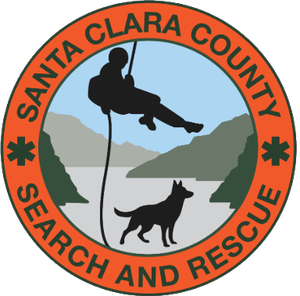

<p align="center">
  
</p>

<h1 align="center">Dispatch Turbo</h1>

<p align="center">
  <strong>Cut SAR call-out dispatch time to under 5 minutes, and reduce data-entry errors.</strong><br>
  The SCCSSAR dispatch console.
</p>

A web app built for the Santa Clara County SAR team that lets a dispatcher photograph a
handwritten call-out form, extract all structured data via Gemini AI, review and correct
it, then push to Everbridge, Slack, CalTopo and D4H in a single workflow — instead of
re-typing the same information into four separate systems by hand.

<picture>
  <source media="(prefers-color-scheme: dark)" srcset="docs/assets/dispatch-flow-dark.svg">
  
</picture>

> Built for SCCSSAR. Designed to be adapted for any team with a paper-based SAR dispatch process.

---

## The Problem

For SAR teams that dispatch from a handwritten or printed paper form, that data needs to
reach four or more downstream systems: an alert notification platform, a tactical mapping
tool, an incident management system, and a team messaging app. Doing it manually means
reading the same form, typing the same address, and copying the same subject description
four times — under time pressure, at odd hours, often by a single volunteer dispatcher.

Errors happen. Time is lost. A missing person's search window narrows while a dispatcher
is re-entering a date of birth into a third system.

---

## What Dispatch Turbo Does

1. **Dispatcher photographs the paper call-out form** on any phone, tablet, or laptop camera; or sends the filled-out PDF form.
2. **Gemini AI reads the form** — extracts the Subject's Data, the Planning Data and at-risk indicators (subject name/DOB/description, LKP
   address, reporting agency, event log timestamps, LPB questionnaire answers) and corrects most 
   common handwriting ambiguities.
3. **Backend geocodes the LKP address** using OpenStreetMap/Nominatim (Google Maps as a
   spelling-correction fallback) and queries nearby POIs via Geoapify — parks, schools,
   shopping centers, fast food, pharmacies — to generate real, driveable staging
   recommendations that will hold a SAR team.
4. **Dispatcher reviews and corrects** the extracted text in a browser textarea — takes
   about 30 seconds to scan.
5. **Two-click dispatch** to each downstream system:
   - 🔔 **Everbridge** — automated notification (group selection + OCEAN# auto-fill + send); polls for confirmed-YES responders. Also the team's **source-of-truth for member SAR email addresses** — the join key D4H and Slack look up against when matching responders
   - 💬 **Slack** — creates a private incident channel, posts welcome with MP info + CalTopo link, clickable staging links for Apple and Google Maps, auto-invites confirmed-YES responders, maintains a live tally in `#active-incidents`
   - 🗺 **Create Incident Map** — creates a CalTopo map with LKP marker, residence marker, staging markers (Incident Command Post icon + alternates), and Koester LPB distances in the text
   - 📋 **D4H** — auto-creates the incident record, syncs per-YES attendance, attaches drone + K9 tabs (Phase 2 Selective mode), Involved Person info
   - 📋 **Google Docs** — (optional) opens a working document with above reference information, and shares with other dispatchers
   - 🗺 **Google Maps** — (optional) opens a reference map centered on the LKP

**Total elapsed time:** under 5 minutes from photo upload to all systems notified.

---

## Features

Everything below is live and in use on the team environment.

**Intake and extraction**

- Gemini multimodal OCR for a photographed handwritten form.
- Deterministic AcroForm extraction for the fillable v2 PDF — that path runs no OCR at all.
- Subject age recomputed from date of birth rather than trusted from the model.
- Server-side normalization of known, recurring OCR misreads.
- Amber verification banner on the JPEG path, prompting the dispatcher to confirm the
  Q1–Q12 checkbox grid by eye.

**Location and staging**

- LKP and residence geocoding — Nominatim first, Google Maps as a spelling-correction
  fallback — with guards that reject a result in the wrong country or on a different
  house number than the officer wrote.
- Staging recommendations built from live POI data (Geoapify): tier-ranked, and
  deduplicated both by address and by proximity so the list offers genuinely different
  places rather than seven doors on one block.
- Automatic widened search when nothing navigable is found near the LKP, with a note to
  the dispatcher that the options are farther out than usual.
- Dispatcher staging override by address, lat/lng, or UTM.
- Koester LPB range-ring analysis, rendered as text, miles first.

**Dispatch**

- **CalTopo** — incident map seeded with LKP, residence, an ICP marker and ranked
  staging alternates.
- **Everbridge** — notification with group selection and event-number auto-fill, then
  polling for confirmed-YES responders.
- **Slack** — private incident channel with a pinned welcome, a separately pinned staging
  message carrying Apple and Google Maps links, the CalTopo map, auto-invite on YES, and
  a live tally in `#active-incidents`.
- **D4H** — incident record, per-YES attendance sync, involved-person details, and K9 and
  drone tabs.
- **Google Doc** — optional working document created in the dispatcher's own Drive via
  OAuth (`drive.file`) and shared with the other dispatchers.

**Safety and operations**

- Google Sign-In with a server-verified email allowlist enforced on every endpoint.
- Form images are never written to disk, and no subject PII reaches the logs — including
  the query strings of outbound geocoding calls, which are redacted at the log handler.
- Per-user and global rate limiting, backed by Firestore.
- Independent Everbridge and Slack rollout flags, so a sandbox environment runs the same
  code without paging anyone.

---

## Architecture

```
Browser (plain HTML/JS — no framework)
    → Google Sign-In (GSI library)
        → Cloud Run backend (Python / FastAPI, gen2)
            → Vertex AI — Gemini 2.5 Flash  (OCR, two-pass)
            → Nominatim / OSM               (address geocoding)
            → Google Maps Geocoding API     (spelling-correction fallback)
            → Geoapify Places API           (staging POI lookup; Overpass/OSM fallback)
            → CalTopo Team API              (incident map creation)
            → Everbridge REST API           (notification + responder polling)
            → Slack Web API                 (private incident channel + tally)
            → D4H API v3                    (incident create + per-YES attendance)
            → Google Docs / Drive           (Working Notes — dispatcher OAuth, drive.file)
            → Cloud Tasks                   (polling scheduler)
            → Firestore                     (rate limits + incident state, 24h TTL)
```

The backend is a single FastAPI service deployed to Google Cloud Run (gen2, scales to
zero). Form images and the intake form data are session-scoped — in-memory only,
never written to disk or a database. Active-incident polling state (responder contact
IDs + ACK status + Slack user IDs once invited) IS persisted in Firestore under a 24h
TTL — the backup window that lets the D4H per-YES sync complete via Cloud Tasks retries
(`max_attempts=5`) or be replayed if D4H is briefly unavailable. **No PII appears in
Cloud Run logs** (enforced by `backend/test_pii_log_patterns.py`). All credentials live
in GCP Secret Manager.

**Identity model:** Everbridge is the authoritative store for each member's SAR email
address. D4H attendance sync, Slack channel invites, and the `#active-incidents` tally
all match responders by looking them up against that email — so a roster change in EB
propagates to the other systems without a separate sync step.

For a full technical walkthrough, see [`docs/architecture.md`](docs/architecture.md).

---

## Processing Time

| Condition | Time |
|-----------|------|
| Warm instance | ~45–60 seconds |
| Cold start (first request after idle period) | ~65–90 seconds |

---

## Deployment

### Prerequisites

**Required**
- Google Cloud Platform account with billing enabled
- Docker (local builds), Terraform (infrastructure), authenticated `gcloud` CLI

**Per integration — each is optional and independently switchable**
- **Geoapify** API key — staging POI lookup (Overpass/OSM remains as a fallback; see
  [`docs/DEPLOYING.md`](docs/DEPLOYING.md) for why a new deployment should not start there)
- **Google Maps** Geocoding API key — spelling-correction fallback for addresses
- **CalTopo** Team account — incident map creation
- **Everbridge** REST credentials — responder notification and polling
- **Slack** bot token — private incident channels
- **D4H** API token — incident records and attendance

Nothing above is required to run the OCR and staging pipeline; an integration you have no
credentials for is simply not offered.

### Quick Start

The full zero-to-running guide is in [`docs/DEPLOYING.md`](docs/DEPLOYING.md).
It covers:
- GCP project setup and IAM
- Enabling required APIs (Vertex AI, Firestore, Secret Manager, Artifact Registry, Cloud Run)
- Building and pushing the Docker image
- Terraform infrastructure apply
- Adding authorized dispatchers
- First test run

Estimated setup time: **60–90 minutes** for someone comfortable with GCP.

### Cost

Running at typical SAR team volume (2–4 activations per month, plus dev testing):

| Usage | Estimated monthly cost |
|-------|----------------------|
| Operational only (~4 form runs/month) | < $0.10 |
| Active development (50–100 runs/month) | < $2.00 |
| Heavy dev / testing (200–400 runs) | ~$5.00 (planning ceiling) |

Vertex AI (Gemini) is the only meaningful cost. Cloud Run, Firestore, and Artifact
Registry all stay within free tier at this usage level.

---

## Documentation

| Doc | Audience | Contents |
|-----|----------|---------|
| [`docs/architecture.md`](docs/architecture.md) | Developers | System design, components, data flow, security model |
| [`docs/DEPLOYING.md`](docs/DEPLOYING.md) | Ops / Developers | Zero-to-running setup: GCP project, APIs, secrets, Terraform, first deploy |
| [`docs/OPERATIONS.md`](docs/OPERATIONS.md) | Ops / Team lead | Day-to-day running: reading logs, rate limits, cost signals, verifying a deploy |
| [`docs/DISPATCHING.md`](docs/DISPATCHING.md) | Dispatchers | Step-by-step use of the app, and what to do when it misbehaves |
| [`.claude/skills/dispatch-after-action/`](.claude/skills/dispatch-after-action/SKILL.md) | Dispatchers / Team leads | Guided after-action review of a call-out: pull the incident's logs first, then a structured debrief across intake, staging, and every downstream system |
| [`docs/FORMS.md`](docs/FORMS.md) | Ops / Developers | The call-out form: what it contains, what to change for your agency, what not to touch |
| [`CONTRIBUTING.md`](CONTRIBUTING.md) | Contributors | How changes get reviewed and merged, the no-real-data rule, and how to run the tests |
| [`CLAUDE.md`](CLAUDE.md) | Contributors | Locked design decisions — what was tried, what failed, and why the current approach is what it is |

`CLAUDE.md` is written as context for AI coding sessions, but it is the most useful
document here for any human changing the code: every locked decision records the failure
that produced it.

---

## Adapting for Your Team

This app was built specifically for SCCSSAR's paper call-out form and downstream systems,
but the core architecture is general-purpose.

**To adapt it for your team, you would need to:**

1. **Rewrite the Gemini prompt** (`backend/gemini.py`) to match your form's field layout.
   The prompt is the most team-specific piece — field names, checkbox positions, agency
   abbreviations, and any local normalization rules.

2. **Update the email allowlist** (`dispatch-authorized-emails` Secret Manager entry) with
   your dispatchers' Google accounts.

3. **Provide your CalTopo Team API credentials** (`caltopo-credential-id`,
   `caltopo-secret`) so the Create Incident Map button works with your team's account.

4. **Update staging tier logic** (`backend/main.py` — `_STAGING_TIER`) if your team
   prefers different venue types as primary staging areas.

5. **Replace Koester percentile tables** in the prompt if your team uses different lost
   person behavior statistics (or remove the LPB section entirely).

6. **Wire up your Everbridge, Slack and D4H credentials** when ready to activate the
   downstream integrations. Everbridge and Slack each have a mode flag (`safe`/`full` and
   `shadow`/`full`) so you can exercise the whole pipeline without paging anyone.

Everything else — auth, geocoding, CalTopo map creation, rate limiting, Cloud Run
deployment — is reusable as-is.

---

## Development

### Repository Structure

```
SAR_dispatch_flow/
├── frontend/
│   └── index.html           # Single-page app (no framework)
├── backend/
│   ├── main.py              # FastAPI app — /ocr, /create-map, /send-notification, …
│   ├── gemini.py            # Gemini prompt + two-pass Vertex AI calls
│   ├── pdf_extract.py       # AcroForm extraction for fillable PDF forms
│   ├── caltopo.py           # CalTopo Team API — HMAC-SHA256 signing, markers
│   ├── everbridge.py        # Everbridge REST client — notify + poll responders
│   ├── slack.py             # Slack Web API — incident channel, pins, tally
│   ├── d4h.py               # D4H API v3 — incident create, attendance sync
│   ├── incidents.py         # Firestore incident documents + skeleton/tombstone
│   ├── gdocs.py             # Google Docs "Working Notes" (dispatcher OAuth)
│   ├── auth.py              # Google ID token verification + email allowlist
│   ├── image_validation.py  # JPEG validation (magic bytes, size, dimensions)
│   ├── rate_limit.py        # Firestore-backed per-user rate limiter
│   ├── secret_health.py     # Secret rotation-age reporting
│   └── requirements.txt
├── backend/Dockerfile       # Build context is the repo root, so it COPYs frontend/ too
├── terraform/
│   └── environments/
│       ├── dev/             # Sandbox — integrations in safe/shadow mode
│       └── sccssar-dev/     # Team environment — integrations live
└── docs/
```

The test suite lives alongside the modules as `backend/test_*.py` and runs as a
pre-flight step in the build scripts — a build fails before it deploys if a test does.

### Key Design Decisions

Several decisions in this codebase were reached after significant debugging time and are
locked. If you are modifying this project, **read [`CLAUDE.md`](CLAUDE.md) before making
changes** — particularly the "Locked Design Decisions" section. It documents what was
tried, what failed, and why the current approach is correct.

Highlights:
- **Two-pass Gemini** — one pass extracts the LKP, the server geocodes it and fetches
  real nearby POIs, then a second pass formats staging recommendations from actual data
  rather than hallucinated locations.
- **Server-side post-processing** — prompt engineering reduces Gemini error rate;
  `re.sub` normalization in `main.py` eliminates known residual errors deterministically.
- **LineString range rings** — CalTopo Polygon geometry captures click events even at
  opacity 0, making markers unclickable; LineString geometry has no fill area.

---

## Status

**Version 1.11.71.** In production and used by SCCSSAR for real callouts.

All four downstream integrations are live on the team environment: Everbridge and Slack
both run in `full` mode, D4H Phase 2 attendance sync is validated end to end, and CalTopo
maps are created per incident. A separate sandbox environment runs the same code with
Everbridge in `safe` and Slack in `shadow` so changes can be exercised without paging
anyone.

Active development is ongoing — see the issue tracker for the current backlog.

---

## Security

See [`SECURITY.md`](SECURITY.md) for the vulnerability reporting policy, security model,
and guidance on safely adapting this app for your team.

Key points:
- Form images and all extracted PII are processed **in-memory only** — never stored to
  disk, database, or logs.
- Google Sign-In + server-side email allowlist gates every request.
- All API credentials live in GCP Secret Manager, never in source code.

---

## License

BSD-3-Clause — see [`LICENSE`](LICENSE).

Copyright (c) 2026, Bill Burns, Safer Futures By Design.

This software is provided as-is for SAR community use. It is not affiliated with or
endorsed by any government agency, SAR organization, or commercial vendor named in the
documentation.

---

## AI Involvement

**AIL:3 — AI Created, Human Full Structure** ([AI Influence Level](https://danielmiessler.com/blog/ai-influence-level-ail))

Most of the code here was written by Claude. A human set the structure and made every
load-bearing decision, validated the behaviour against real callout data, and reviewed and
merged every change.

Decisions that were human calls, not model output: routing fillable PDFs to deterministic
AcroForm extraction instead of OCR; keeping the two-pass Gemini design so staging comes
from real geocoded POIs rather than generated ones; refusing to auto-recompute a
dispatcher's Koester category; declining to send negative responses to D4H; and the rule
that no recovery path may depend on the dispatcher's browser still being open.

The model has also been confidently wrong in ways that human review caught — including
test "pins" that read production source and still asserted nothing, and a distance guard
whose premise was sound but whose reference point was not. Where a claim in these docs was
measured against a live API it says so; where it was not, that is stated too.

---

## Contact

**Bill Burns** — Project lead, SCCSSAR
bill.burns@sccssar.org

If you are a SAR team interested in adopting or adapting this tool, please open an issue
— questions about adapting it are welcome and help make the docs better for the next team.
